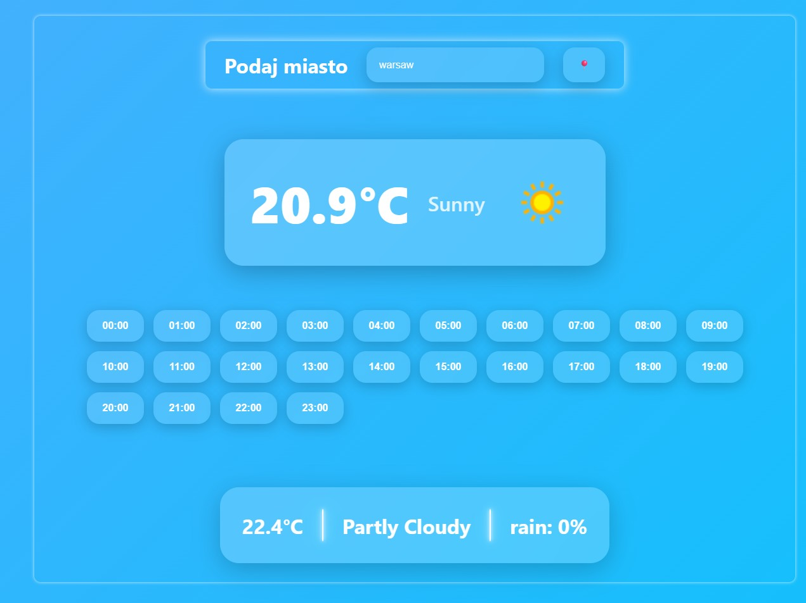
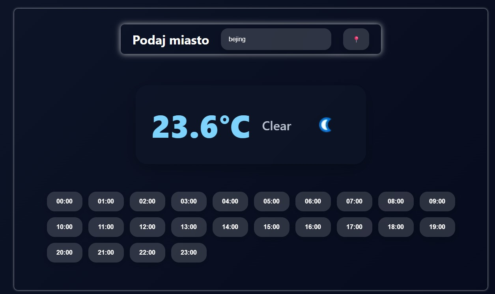

# 🌤️ Weather App

Modern weather application built with **FastAPI**, **HTML/CSS**, and **JavaScript**.

The app allows users to:
- search weather by city
- use geolocation 📍
- view current weather
- check hourly forecast
- switch automatically between day/night themes
- enjoy smooth UI animations and glassmorphism design

---

# 🚀 Features

✅ Current weather  
✅ 24-hour forecast  
✅ Dynamic day/night mode  
✅ Geolocation support  
✅ Responsive design  
✅ Animated UI  
✅ FastAPI backend  
✅ WeatherAPI integration  

---

# 🛠️ Technologies

Frontend:
- HTML5
- CSS3
- JavaScript

Backend:
- Python
- FastAPI
- Requests
- Python-dotenv

API:
- WeatherAPI

---

# 📸 Preview




---

# ⚙️ Installation

Clone repository:

```bash
git clone https://github.com/bensiuu/weather-app.git
cd weather-app
